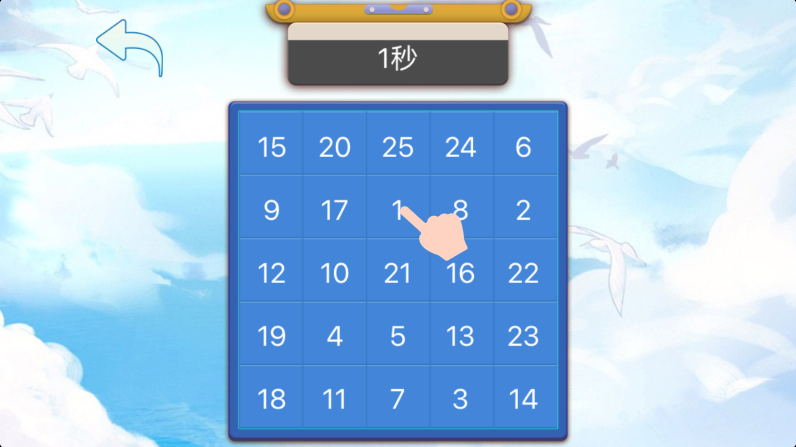
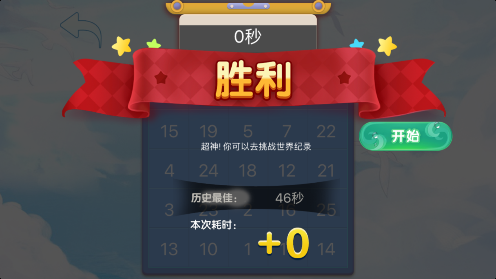

# 棋开得胜
舒尔特棋, 打开视野, 打开人生.

睁大双眼, 盯着棋盘, 按照从小到大的顺序点击屏幕中的数字.
简单的规则, 却有着不同的挑战, 你想知道5x5模式的世界记录是多少吗? 先来试一试吧!

从新手模式的5x5做起, 一个普通人大概可以在40s左右完成挑战, 而对于一个对视野幅度有着更高追求的人, 跨入20s大关才是他们追求的.

之后你可以挑战新手模式的8x8, 这是个更让人眼花缭乱的模式. 慢慢来, 全程你可能要花费3分钟, 这三分钟的辛苦程度比得上1000m跑哦! 只有专心的人才能更快更轻松地坚持到最后!

新手模式中每个数字必须要点击后才算成功, 而在老手模式, 我们相信您已经足够自觉, 只要您觉得已经找到了一个数字, 便可以不进行点击, 直接寻找下一个数字, 看看自己速度的极限究竟是多少, 默默地找到了所有的数字后, 你可以点击"结束"按钮, 我们相信你真的已经找到了所有的数字!
是不是已经迫不及待了, 快来试试吧!
联系我们:
- cq@applemoon.cn
